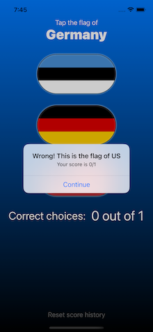
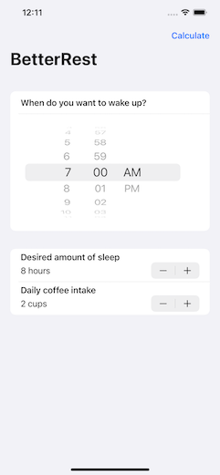

# swift-tutorial
I plan on learning SwiftUI following the tutorial provided [here](https://www.hackingwithswift.com/100/swiftui). I will put the codes I created during the process here.

Since I'm not full-time on this, I might not be able to follow exactly after the Days requirement in that tutorial. But still, I hope I will be learning things in a fair period of time.

## Contents

### 01 - WeSplit

Things learned:

* Intro to SwiftUI
* Text, TextField, Form, Section, NavigationView, Picker
* .navigationBarTitle(), pickerStyle()
* @State, $ (two-way operation)
* ?? (nil coalescing operator)

### 02 - Guess the flag

  

Things learned:

* Built-in styles in SwiftUI
* VStack, HStack, ZStack, Spacer
* Color, Gradient
* .foregroundColor(), .font(), .fontWeight()
* Button, Image, .randeringMode(), .clipShape(), .overlay(), .shadow(), .alert()

### 03 - Views and modifiers

Things learned:

* How Views and Modifiers work
* Custom views, custom ViewModifier, custom Container

### 04 - Better Rest

 

Things learned:

* Date, DateFormatter, DateComponents
* Stepper, DatePicker, 
* navigationBarItems()
