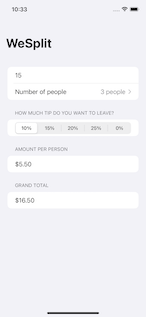

# swift-tutorial
I plan on learning swift following the tutorial provided [here](https://www.hackingwithswift.com/100/swiftui). I will put the codes I created during the process here.

Since I'm not full-time on this, I might not be able to follow exactly after the Days requirement in that tutorial. But still, I hope I will be learning things in a fair period of time.

## Contents

### 01 - WeSplit

Things learned:

* Intro to SwiftUI
* Text, TextField, Form, Section, NavigationView, Picker
* .navigationBarTitle(), pickerStyle()
* @State, $ (two-way operation)

